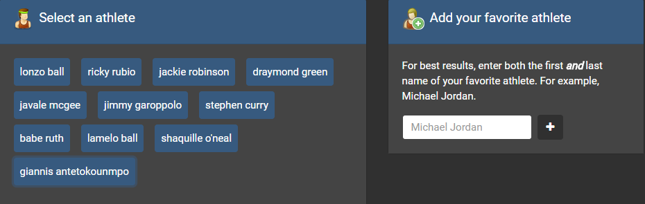
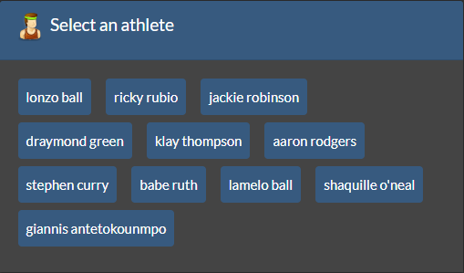
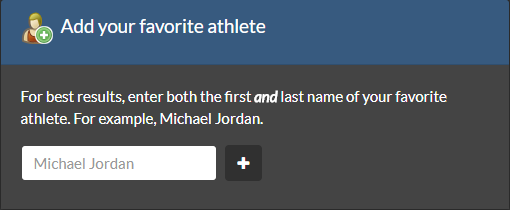
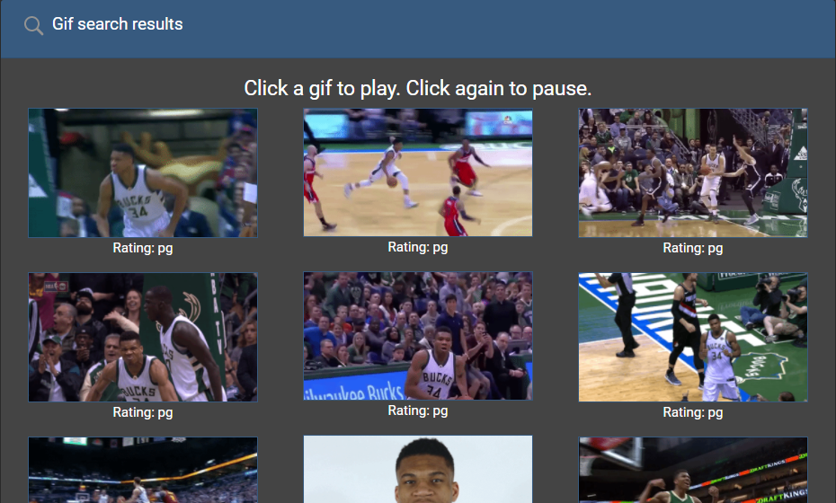
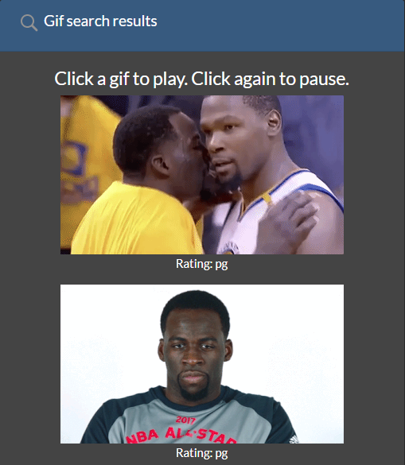

# Giphy-API-Project

## Overview

This website uses the GIPHY API to populate the site with gifs of your favorite athletes. Specifically, it uses the jQuery AJAX method to perform AJAX GET requests to the query URL to get data from the GIPHY API. To perform an AJAX call, a query URL needs to be constructed. The query URL consists of the host, path, search term (the name of the athlete), the maximum number of gifs to return, and an API key. After the query URL is constructed, the URL is used to perform the request. When the request is complete, the site uses Javascript and jQuery to add static gif images to the HTML. You can select an athlete from a pre-defined list or add your own athlete to the list if the athlete you want to search for is not available. To play a gif, click it. Click it again to pause.

## Live

https://philipstubbs13.github.io/Giphy-API-Project/index.html

## Screenshots

## Technologies used to create site

<li>HTML5</li>
<li>CSS</li>
<li>Bootstrap 4.0.0-beta</li>
<li>Javascript</li>
<li>JQuery</li>
<li>AJAX</li>
<li>GIPHY API</li>

## How to use the GIPHY API

To learn about the GIPHY API and the various API parameters, read the <a href="https://developers.giphy.com/docs/" target="_blank">GIPHY API documentation</a>. You should be familiar with the API before contributing to this site or creating your own.

GIPHY requires developers to use a key to access API data. To use the GIPHY API, you'll need a (free) GIPHY account. Then, you can obtain a key by creating an app.

Ensure that you switch the protocol in the query URL from http to https, or the app might not work properly when it is deployed.

## How to use site

### Selecting an existing athlete
<ol>
	<li>Click a button in the <b>Select an athlete</b> section.</li>
	<li>When you click a button, 10 static, non-animated gif images related to the athlete you chose are retrieved from the GIPHY API and placed in the <b>Gif search results</b> section.</li>
</ol>

### Adding your own athlete
<ol>
	<li>In the <b>Add your favorite athlete</b> section, enter the first <b>and</b> last name of the athlete you want to add. For example, Kobe Bryant.</li>
	<li>Click the + icon.</li>
		<info>A button is created for the athlete you entered and added to the <b>Select an athlete</b> section.</info>
	</li>
	</li>Click the button for your athlete.</li>
	<li>When you click a button, 10 static, non-animated gif images related to the athlete you chose are retrieved from the GIPHY API and placed in the <b>Gif search results</b> section.</li>
</ol>

### Playing and pausing gifs

Click a gif image to play or animate the gif. Click the image again to pause.

### Gif rating
<info>The gif rating (for example, G or PG) is displayed under each gif. This data is retrieved from the GIPHY API.</info>

## Future feature enhancements
<ul>
	<li>Right now, the <b>Add your favorite athlete</b> section has one user input box to enter both first name and last name. I wonder if it would be better to have two user input boxes. One input box to enter first name. Another input box to enter last name.</li>
	<li>Search Google Fonts for a different font.</li>
</ul>

## Icons
All icons used for this project can be obtained from <a href="https://www.iconfinder.com/" target="_blank">Iconfinder</a>.

## Feedback

Feel free to send feedback via <a href="https://twitter.com/iamPhilStubbs" target="_blank">Twitter</a>, email (philipstubbs13@gmail.com), or <a href="https://github.com/philipstubbs13/Giphy-API-Project/issues/" target="_blank">file an issue</a>. Feature requests are always welcome. If you wish to contribute, please send an email with your request to philipstubbs13@gmail.com to discuss.

